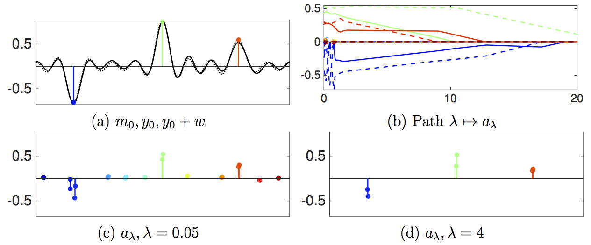

This toolbox reproduces the numerical illustrations of the paper:

V. Duval, G. Peyré. [Sparse Spikes Deconvolution on Thin Grids](https://hal.archives-ouvertes.fr/hal-01135200). Preprint HAL:01135200, 2015.

Content
-------

It contains the following directories:
* asymtotics/: display of the various pre-certificate for BLASSO and C-BP.
* compressed-sensing/: numerical test of extended support for a compressed sensing setup.
* proximal/: implementation of the Forward-Backward algorithm to solve the C-BP problem.

Copyright
-------

Copyright (c) 2015 Gabriel Peyré
